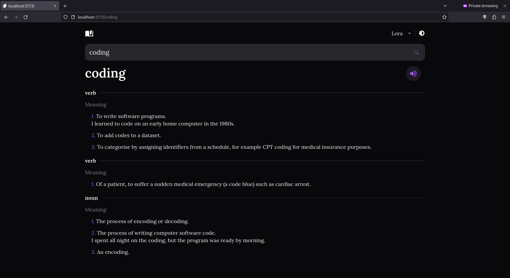

# English Dictionary

Made useing slvete, tailwindcss and [dictionaryapi.dev](https://dictionaryapi.dev/) api

## Screenshot



## Developing

Once you've cloned the project and installed dependencies with `npm install` (or `pnpm install` or `yarn`), start a development server:

```bash
npm run dev
```

## Building

To create a production version of your app:

```bash
npm run build
```

You can preview the production build with `npm run preview`.
